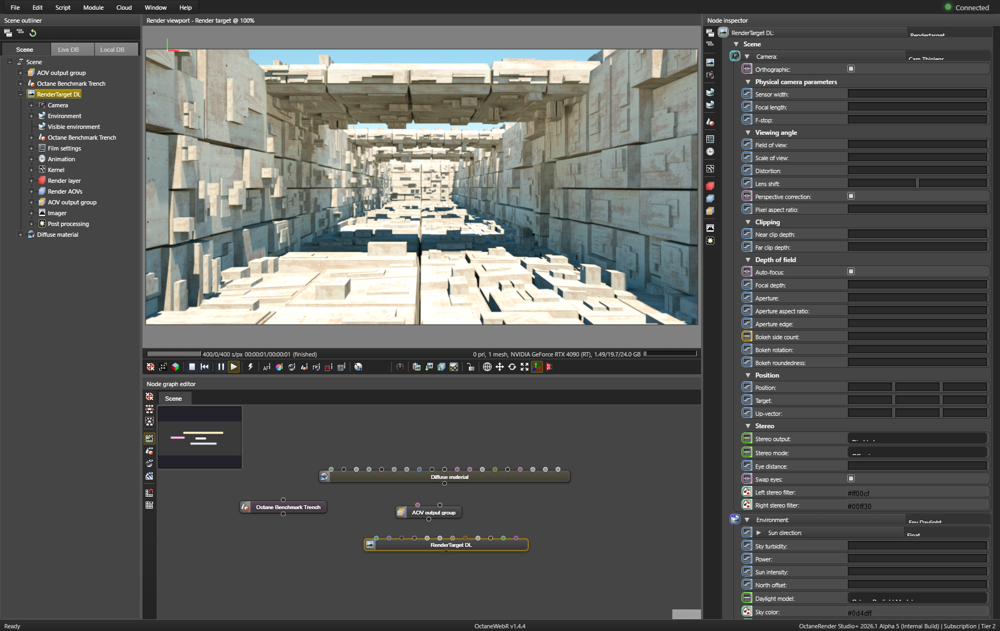
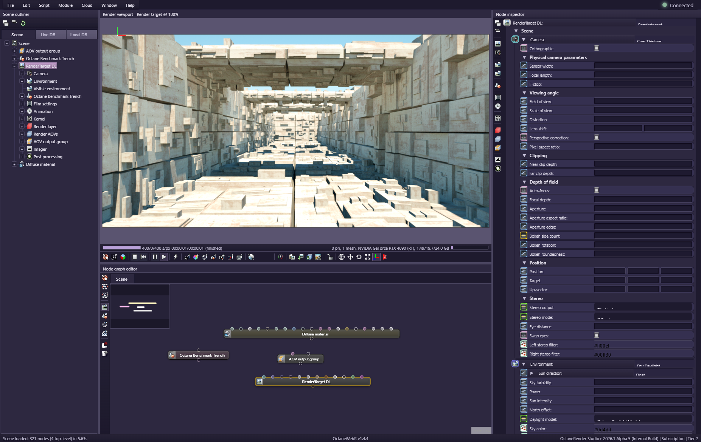
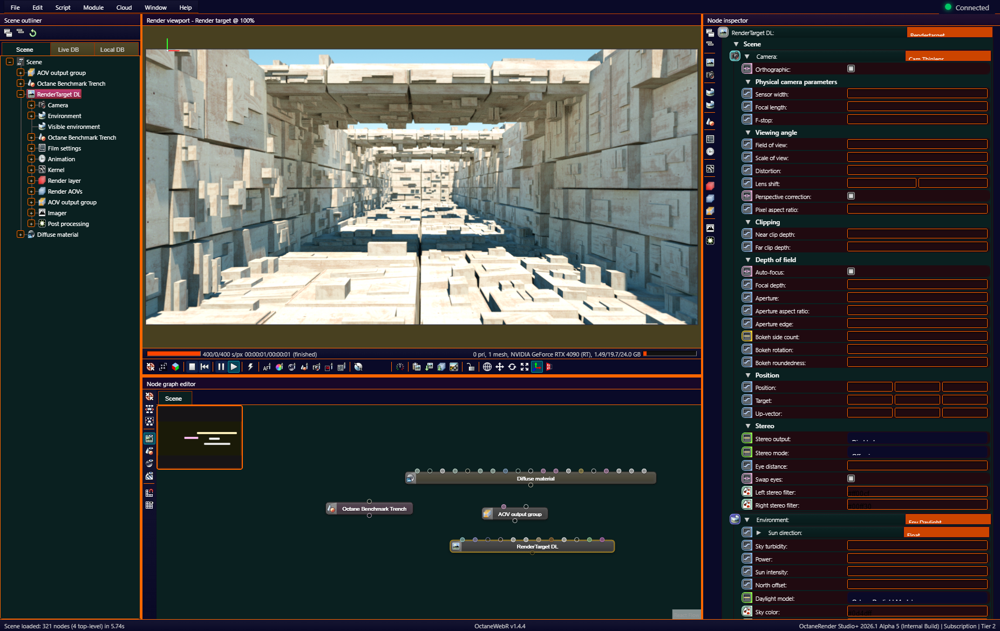

# octaneWebR

**Modern web-based UI for Octane Render Studio with real-time gRPC integration**

A React/TypeScript application that provides a browser-based interface for Octane Render, communicating with Octane via the gRPC LiveLink API.



---

## Quick Start

See **[QUICKSTART.md](./QUICKSTART.md)** for detailed setup.

### Prerequisites

- **Octane Render gRPC build** installed and running (https://filedrop.otoy.com/f/393752)
- **LiveLink enabled** in Octane (File → Preferences → GRPC API → Enable)
- **Node.js 18+** installed

### Launch

```bash
npm install              # First time only
npm run dev              # Start development server
```

Open **http://localhost:57341**. Connects to Octane at `localhost:51022`.

### API Version

Edit `api-version.config.js` (line 22) to switch between Alpha 5 and Beta 2. Then `npm run build && npm run dev`. See **[ARCHITECTURE.md](./ARCHITECTURE.md#api-version-configuration)** for details.

---

## Features

### Node Graph Editor

ReactFlow-based, 755+ node types in 25 categories, drag-and-drop connections, multi-select, copy/paste, connection cutter (Ctrl+Drag), search (Ctrl+F), minimap.

### Scene Outliner

Hierarchical tree with type-specific icons, visibility toggles, selection sync. Tabs: Scene, LiveDB (OTOY library), LocalDB (local materials).

### Node Inspector

Real-time parameter editor: booleans, numbers, vectors, color pickers, enum dropdowns, text fields. Node type dropdown for replacing nodes. Collapsible groups.

### Render Viewport

Live render streaming, camera controls (orbit/pan/zoom), HDR display, picker tools (Material, Object, Focus, Camera Target, White Balance), render region.

### Menu System

File (New/Open/Save/Package), Edit (Undo/Redo/Cut/Copy/Paste), Script (Batch/Daylight/Turntable), View (panels, F5 refresh), Window (Material DB, Fullscreen F11), Help.

### Infrastructure

- TypeScript strict mode, embedded gRPC proxy (Vite plugin), multi-level Logger
- Command History (50-action undo/redo), CSS Variables theme system (134 vars)
- HMR, code splitting, React Query, error boundaries

---

## Architecture

**Stack**: React 18 + TypeScript + Vite + ReactFlow v12

**Service Layer**: 11 modular services extending `BaseService` — see [ARCHITECTURE.md](./ARCHITECTURE.md) for full details.

```
Browser → http://localhost:57341/api/grpc/{service}/{method} → Vite plugin → localhost:51022 (Octane)
WebSocket: ws://localhost:57341/ws (callbacks, render streaming)
```

### Themes

Three CSS variable themes: **Octane** (default dark), **Vibe** (pastel purple), **Debug** (colored layout).

  

---

## MCP Server — AI Scene Creation

MCP server exposes Octane's gRPC API to AI agents. Claude creates/modifies/renders scenes while octaneWebR visualizes in real time.

```bash
cd mcp && npm install    # First time only
```

`.mcp.json` already configured in project root. 21 tools: info, project, camera, render, scene, node, attribute.

```
Claude Code ←stdio→ MCP Server ←gRPC→ Octane ←gRPC→ octaneWebR (browser)
```

For Octane docs, add: [Octane Docs MCP](https://octane-mcp.otoy.ai/sse). For AI 3D assets: [OTOY Studio](https://otoy.studio/).

---

## Project Structure

```
octaneWebR/
├── client/src/
│   ├── components/               # React components (Viewport, NodeGraph, Outliner, Inspector, etc.)
│   ├── services/octane/          # 11 gRPC service wrappers
│   ├── services/OctaneClient.ts  # Main API facade
│   ├── hooks/                    # React hooks
│   ├── utils/                    # Helpers, Logger, formatters
│   ├── constants/                # NodeTypes (755+), icon mappings
│   ├── styles/                   # CSS themes + component styles
│   └── App.tsx                   # Root component
├── server/
│   ├── proto/                    # Beta 2 proto files
│   ├── proto_old/                # Alpha 5 proto files
│   └── src/                      # gRPC proxy server
├── mcp/src/                      # MCP server (21 tools, stdio)
├── api-version.config.js         # Alpha 5/Beta 2 switch
├── vite-plugin-octane-grpc.ts    # Embedded proxy plugin
└── package.json
```

---

## Development

```bash
npm run dev          # Dev server (port 57341, HMR)
npm run build        # Production build (dist/client/)
npx tsc --noEmit     # Type check only
npm run lint         # ESLint
```

**Key files**: `OctaneClient.ts` (facade), `NodeGraphEditor.tsx` (1500+ lines), `vite-plugin-octane-grpc.ts` (proxy).

---

## Documentation

- **[QUICKSTART.md](./QUICKSTART.md)** — Setup guide
- **[ARCHITECTURE.md](./ARCHITECTURE.md)** — Architecture & patterns
- **[CHANGELOG.md](./CHANGELOG.md)** — Version history
- **[IMPROVEMENTS.md](./IMPROVEMENTS.md)** — 29-item backlog
- **[OTOY_COMPARISON.md](./OTOY_COMPARISON.md)** — Feature gap analysis vs Octane SE
- **[PROTO_PLAN.md](./PROTO_PLAN.md)** — Proto API coverage plan

### External

- [Octane SE Manual](https://docs.otoy.com/standaloneSE/CoverPage.html)
- [Octane Help Agent](https://octane-agent.pages.dev/)
- [Octane MCP Server](https://octane-mcp.otoy.ai/sse)
- [ReactFlow v12 Docs](https://reactflow.dev/)

---

## Stats

~17,000 lines TypeScript/TSX | 35+ components | 11 services | 755+ node types | 134 CSS variables | 30+ proto files

---

OTOY © 2026 - All rights reserved. Octane Render® and OTOY® are registered trademarks of OTOY Inc.

**Version**: 1.4.5 | **Status**: Active Development
